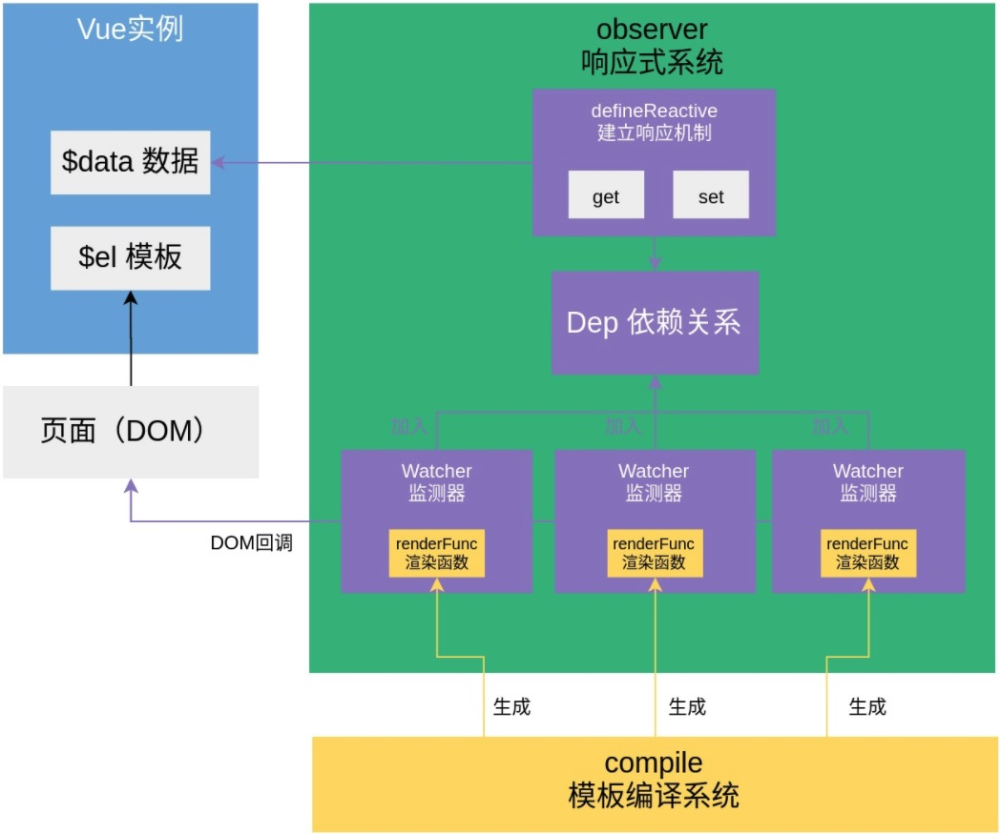

# mini-vue

自己实现一个 mini 的 vue

作为通读 Vue 源码的一个切入点

## 核心模块

- Vue
  - 实例化对象
  - 进行数据绑定
  - 进行模板编译
  - 进行数据代理

- Observer 响应式系统
  - 数据劫持
  - 监听变化

- Watcher 观察者
  - 接受 compile 解析内容 替换成新的值
  - 收集依赖
  - 借助回调更新 DOM

- Dep 依赖关系存储器
  - 发布订阅
  - 一个数据实例化一个 dep

- Compile 模板编译系统
  - 获取模板
  - 解析表达式
  - 替换生成

- proxy 代理
  - this.$data.count ---> this.count

## 不涉及

- 自定义指令
- Array 响应式
- 生命周期
- 全局 API
- 虚拟 DOM

## 图解

